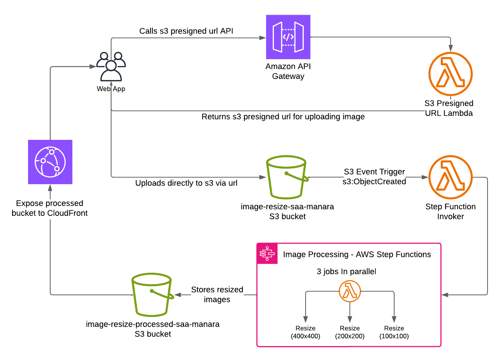

# Serverless Image Processing Pipeline on AWS

This project demonstrates a scalable, event-driven, and cost-effective serverless architecture for processing images on AWS. Users can request a secure upload link from an API, upload an image directly to S3, and have it automatically resized by a Lambda function.

## Architecture Diagram



## Key Features

*   **Secure Uploads**: Uses S3 Pre-signed POST URLs to allow clients to upload files directly and securely to an S3 bucket without needing AWS credentials.
*   **Dynamic Image Resizing**: API parameters allow clients to specify the desired dimensions for the output image.
*   **Event-Driven Processing**: S3 event triggers automatically invoke a Lambda function to process images as soon as they are uploaded.
*   **Fully Serverless**: Built entirely on managed AWS services (API Gateway, Lambda, S3) for infinite scalability and a pay-per-use cost model.

## Tech Stack & AWS Services

*   **AWS IAM**: For securely managing permissions between AWS services.
*   **Amazon S3**: For storing original and processed images.
*   **AWS CloudWatch**: For logging and monitoring.
*   **Amazon API Gateway**: To expose a public REST API endpoint for clients to request upload URLs.
*   **AWS Lambda**: For running the application logic for both generating pre-signed URLs and processing images.
*   **Pillow (PIL)**: The image processing library used for resizing.

## How It Works

The application flow is divided into two main parts:

**1. The Authorization Flow (Getting a Pre-signed URL)**
1.  The client (e.g., a web browser) makes a `POST` request to the endpoint on API Gateway, providing the desired `filename` in the JSON body.
2.  API Gateway uses a Lambda proxy integration to invoke the **`GeneratePresignedUrl`** function.
3.  This Lambda function validates the input and generates a temporary, secure pre-signed POST URL using the AWS SDK.
4.  The pre-signed URL and its required form fields are returned to the client as a JSON response.

**2. The Upload & Processing Flow**
1.  The client uses the response from the API to construct a `multipart/form-data` POST request and sends the image file **directly to the S3 bucket URL**.
2.  Amazon S3 validates the request against the pre-signed policy. If valid, the file is uploaded to the source bucket.
3.  The `s3:ObjectCreated:Put` event on the source bucket automatically triggers the **`ResizeImage`** Step function, which runs 3 parallel Lambda functions which resize the image into 400x400, 200x200, and 100x100 fixed sizes. This Step function is a demo and later will be more practical.
4.  The `ResizeImage` Lambda downloads the image file into memory, reads the `width` and `height` from request body, resizes the image using Pillow, and converts it to JPEG.
5.  Finally, the function uploads the new, processed image to a separate destination S3 bucket.

## Getting Started

### Prerequisites

* An AWS Account, including the 12 month free-tier

### Project Setup

1.  **Clone the repository:**
    ```bash
    git clone https://github.com/yousefelkilany/image-processing-serverless-webapp
    cd image-processing-serverless-webapp
    ```

2.  **Configure Environment Variables:**
    Some Lambda functions require environment variables.

    **For `GeneratePresignedURL-SAA-Manara`:**
    | Key             | Value                                 | Description                        |
    | --------------- | ------------------------------------- | ---------------------------------- |
    | `SOURCE_BUCKET` | `image-resize-saa-manara`       | The S3 bucket for original uploads.|

    **For `ImageResizeLambda-SAA-Manara`:**
    | Key                  | Value                                   | Description                          |
    | -------------------- | --------------------------------------- | ------------------------------------ |
    | `DEST_BUCKET` | `image-resize-processed-saa-manara`      | The S3 bucket for resized images.    |

### Deployment

#### 1. Provide necessary layers for `ResizeImage` Lambda

This project uses Pillow layer from [KLayers](https://github.com/keithrozario/Klayers/tree/master/deployments/python3.12), which is plug-and-play layer for pillow libray, without the need for uploading custom `python_package.zip`.

#### 2. Deploy AWS Resources

I set it up manually in the AWS Console, but also it can be automated with IaC tools like Terraform, here're the steps:

1.  **Create S3 Buckets**: Create two S3 buckets for source and processed files. Keep "Block all public access" enabled as is.
2.  **Create IAM Roles and Policies**: Create the necessary IAM roles and policies for all three Lambda functions, G and Step Invoker, granting them permissions to S3 and CloudWatch Logs.
3.  **Create Lambda Functions**:
    *   Create three Lambda functions (`GeneratePresignedURL-SAA-Manara`,  `ImageResizeLambda-SAA-Manara` and `ImageProcessingInvokerLambda-SAA-Manara`) with **Python 3.12** runtime.
    *   For the `ImageResizeLambda-SAA-Manara`, refer to Klayers for target python runtime and library. I layer for `Python 3.12` runtime, `Pillow` lib and deployed in `us-east-1` region, provided via this arn `arn:aws:lambda:us-east-1:770693421928:layer:Klayers-p312-Pillow:6`.
    *   Set the environment variables as described above.
    *   For the `ImageProcessingInvokerRole-SAA-Manara`, nothing much besides proper permissions and simple python script that invoke step function.
4.  **Configure S3 Trigger**: Configure the source S3 bucket to trigger the `ImageProcessingInvokerLambda-SAA-Manara` on `s3:ObjectCreated:Put` events.
5.  **Set up API Gateway**: Create a REST API, I added a `/upload-image` resource with a `POST` method, and integrate it with the `GeneratePresignedURL-SAA-Manara` using Lambda Proxy Integration. **Enabled CORS**. Deployed the API to a stage `v1`.

## Usage

You can use any HTTP client to interact with the API. refer to [imageUpload API script](src/pages/api/imageUpload.ts) for example usage.
